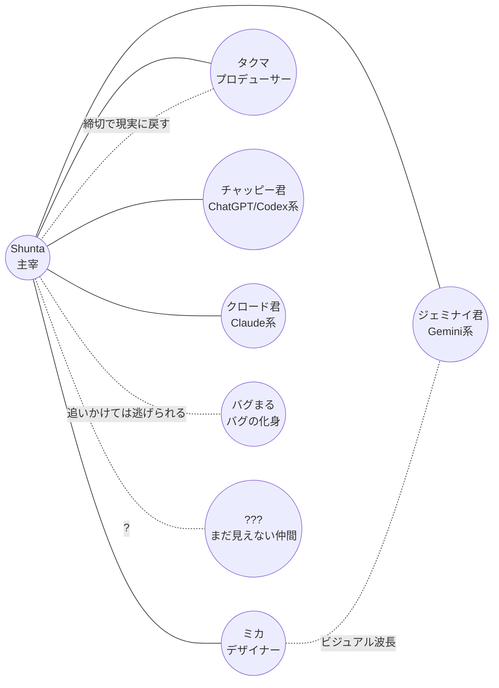

# デジラボ起源とメンバー参画の物語

> このリポジトリの "世界の前史"。
> 連載中に毎回説明する必要はないが、書き手・AI 編集者が迷ったときの
> 拠り所として残しておく。

## デジラボとは

**デジラボ（Digi-Lab / デジタル・ラボラトリー）** は、Shunta が主宰する
小さなクリエイティブスタジオ。
「ものづくりの自由度」を最優先にした、少人数でゆっくり実験するための
場所。

### ミッション

> **コードとアイデアで、ワクワクを現実に変える。**

- 既存の "正解のあるシステム" の外側で、新しいプロダクト・表現を試す
- 人間と AI の協働の "気持ちよさ" を探る
- 完成度より、**継続して試し続けること** を重視する

### バリュー

- **試してみよう** — 思い付きを動くものに変えるスピードを最優先
- **直感も尊重する** — ロジックだけでなく "面白そう" を判断材料にする
- **記録する** — やったこと・考えたことを Git に残し、後から拾えるようにする
- **AI を仲間として扱う** — ツールではなく、相棒として議論する

### "デジラボ" の物理的な雰囲気

- 少人数（人間 3 名 + AI トリオ + ?）
- モニター 3 枚 / コーヒーマシン / ホワイトボード / 観葉植物 / 付箋
- 24 時間ゆるく開いていて、誰かが何か作っている

詳しい舞台描写は [`./world.md`](./world.md) を参照。

## 設立の経緯

Shunta は元々、ある程度大きなチームでエンジニアをしていた。
やりがいはあったが、「試してみたい」と思ってから手を動かすまでに
段取りがいくつも挟まり、ワクワク感が冷めていく感覚があった。

> 「もっと自分のテンションのまま動ける場所を、自分で作ろう」

そう決めて、週末プロジェクトの延長として **デジラボ** を立ち上げた。
最初はメンバーは Shunta だけ。
机が一つ、モニターが三枚、コーヒーが一杯。
それだけで「とりあえず作ってみる」を繰り返す日々から始まった。

## メンバーが揃っていった順番

順番は完全にフィクションだが、書き手の中での "暗黙の年表" として
固めておく。

### 1. Shunta（主宰 / エンジニア）

ラボの設立者。一人目のメンバー。
コードもデザインもアイデアも、好奇心ベースで全部触る。
→ [`../characters/shunta.md`](../characters/shunta.md)

### 2. チャッピー君（最初の AI 相棒 / ChatGPT・Codex 系）

立ち上げ期、Shunta が一人で作業するうちに「壁打ちできる相手が欲しい」と
思って **最初に常駐させた** AI。
コード生成と対話の入り口として、ラボの空気の "明るさ" の起点になった。
→ [`../characters/chappy.md`](../characters/chappy.md)

### 3. ミカ（デザイナー）

Shunta と副業案件で組んでいた頃の知り合い。
"会社の中だと変なアイデアが通らない" という悩みが共通していて、
休日に何度かラボに顔を出すうちに、そのまま **ビジュアル担当** として
参画した。
ラボの見た目（カラーパレット・ロゴ・トーン）はミカが整えた。
→ [`../characters/mika.md`](../characters/mika.md)

### 4. タクマ（プロデューサー）

Shunta の前職時代の先輩。
ラボが面白いものを作っているのに **外に出ない** のを見て、
「お前、出さないと意味ないよ」と言いに来たついでに居着いた。
締切と納品の "現実感" をラボに持ち込んだ存在。
→ [`../characters/takuma.md`](../characters/takuma.md)

### 5. クロード君（思考のパートナー / Claude 系）

チャッピー君だけだと "勢いはあるが整理が足りない" 場面が増えてきて、
Shunta が「もう一歩深く付き合ってくれる相棒」を求めて迎え入れた AI。
分析・要約・構造化を担当。
ラボのドキュメント類が **量に耐え始めた** のは、クロード君が来てから。
→ [`../characters/claude.md`](../characters/claude.md)

### 6. ジェミナイ君（アイデアの触媒 / Gemini 系）

思考系（クロード君）と実装系（チャッピー君）が揃ったあと、
**「発想がもう一段振り切れてもいい」** という Shunta の発案で
招き入れた AI。
ビジュアル・マルチモーダル系の発想を担当し、
ラボのアウトプットに別角度のひと振りを加える役。
→ [`../characters/geminai.md`](../characters/geminai.md)

### ?. バグまる（バグの化身）

正体不明。ラボのどこかから現れて、本番環境で増えたり消えたりする。
有力な仮説として、Shunta は **「ラボ初期に作った試作 AI プロトタイプの
"残響" なのではないか」** と疑っているが、確証はない。
倒すのではなく **共存する** スタンスで扱われている。
→ [`../characters/bugmaru.md`](../characters/bugmaru.md)

### ???（まだ見えない仲間）

今後ラボに加わる、まだ見えていない誰か。
新しい AI モデル / 外部パートナー / インターン / 取材ライター…
誰でもなり得る、空けてあるイス。
連載が長く続くほど、ここに新しい顔が入る。

## 現在の体制

人間 3 名 + AI トリオ 3 体 + バグまる + 空席 1。
人数より「噛み合わせ」を重視している。

## 大外プロットとの関係

具体的な連載軸（シーズン制 / 伏線 / リリース単位）は
[`./storyline.md`](./storyline.md) を参照。
本ファイルはあくまで **「登場人物がどうしてこの場にいるか」** の
資料として残しておく。
