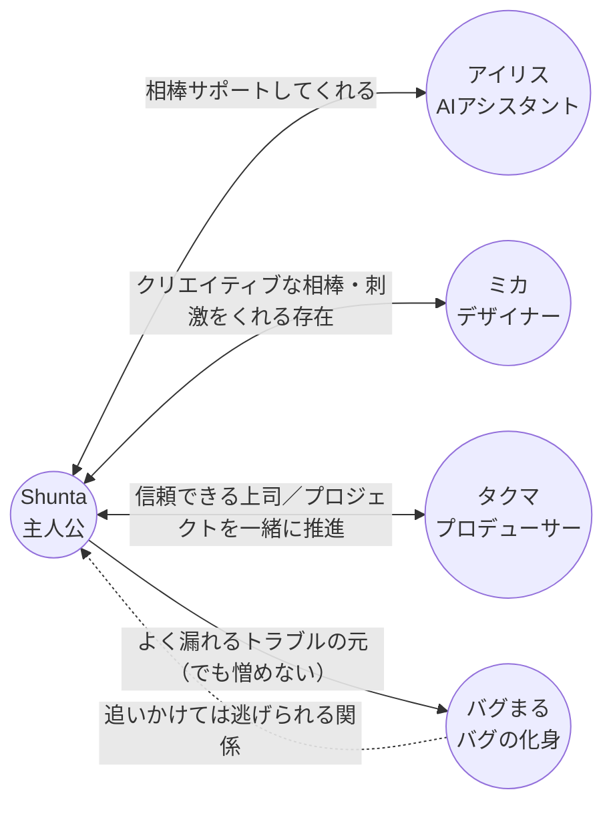

# 人間関係マップ

主人公 **Shunta** を中心とした、登場人物の関係性。

## 関係性の言語化

### Shunta ↔ アイリス（AI アシスタント）

- 24 時間そばにいる **相棒**
- 雑談相手・調べ物・ツッコミ役
- たまにボケて Shunta が突っ込む構図にもなる

### Shunta ↔ ミカ（デザイナー）

- **クリエイティブな相棒であり良きライバル**
- ビジュアル面で刺激をくれる存在
- 「もっとこうしたら？」が口ぐせ

### Shunta ↔ タクマ（プロデューサー）

- 信頼できる上司
- プロジェクトを一緒に推進する相棒
- 締切最優先、細かい作業はデキる人に任せるタイプ

### Shunta ↔ バグまる（バグの化身）

- 倒しても倒しても出てくる **永遠のライバル兼マスコット**
- 追いかけては逃げられる関係
- バグまるが現れる回 = "デバッグ地獄回"

---

各キャラの詳細プロフィールは [`../characters/`](../characters/) を参照。
