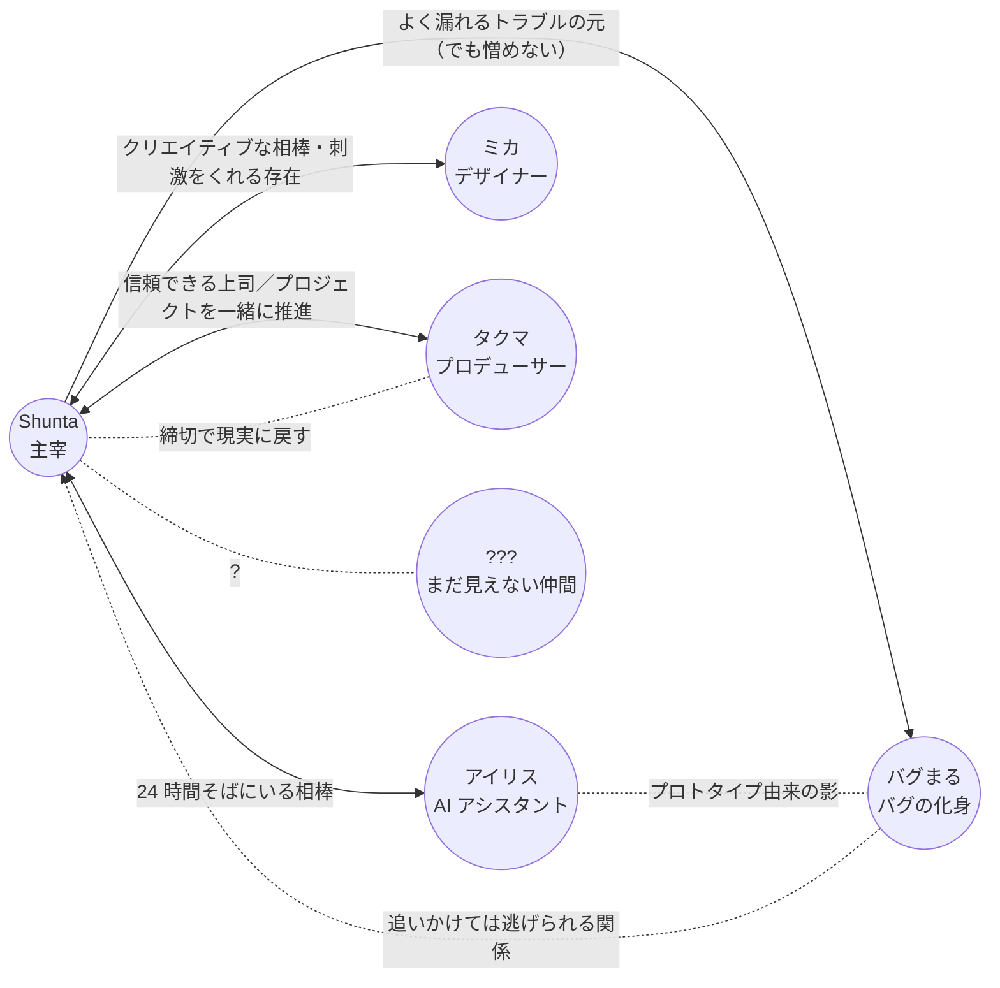

# 人間関係マップ

主人公 **Shunta** を中心とした、登場人物の関係性。
各キャラがどういう経緯でデジラボに参画したかは [`./origin.md`](./origin.md) を参照。

## 関係性の言語化

### 人間メンバー

#### Shunta ↔ ミカ（デザイナー）

- **クリエイティブな相棒であり良きライバル**
- ビジュアル面で刺激をくれる存在
- 「もっとこうしたら？」が口ぐせ

#### Shunta ↔ タクマ（プロデューサー）

- 信頼できる上司
- プロジェクトを一緒に推進する相棒
- 締切最優先、細かい作業はデキる人に任せるタイプ
- ラボの "外と繋がる窓口" でもある

### AI

#### Shunta ↔ アイリス（AI アシスタント）

- **24 時間そばにいる相棒**
- 雑談相手・調べ物・ツッコミ役
- たまに真顔で軽くボケて、Shunta が突っ込む構図にもなる
- ベンダーやモデルを特定しない **抽象的な AI の存在** として置いている

### バグまる

#### Shunta ↔ バグまる（バグの化身）

- 倒しても倒しても出てくる **永遠のライバル兼マスコット**
- 追いかけては逃げられる関係
- 由来は仮説段階（[`./origin.md`](./origin.md) / [`./storyline.md`](./storyline.md)）

#### バグまる ↔ アイリス

- アイリスのカメラには **なぜか映らない**
- アイリスの初期プロトタイプ由来ではないか、という仮説の中心関係

### ???（まだ見えない仲間）

- 連載が育つほど、ここに新しい顔が入る
- 例: 新しい AI / 外部パートナー / インターン / 取材ライター

---

各キャラの詳細プロフィールは [`../characters/`](../characters/) を参照。
シリーズ全体の大外プロットは [`./storyline.md`](./storyline.md) を参照。
