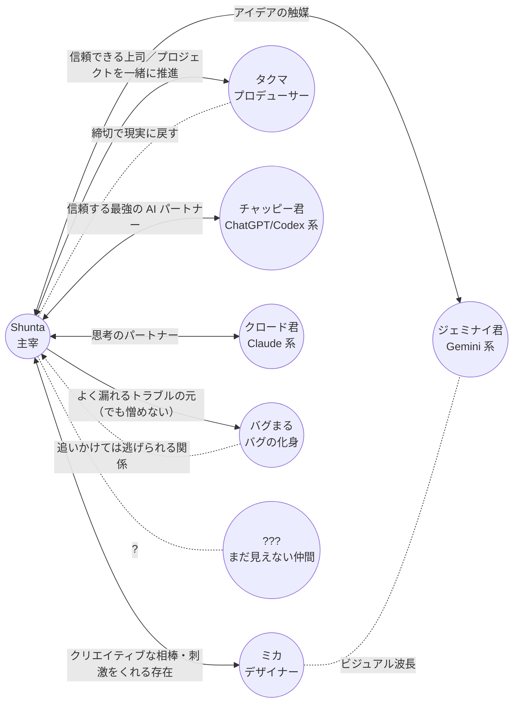

# 人間関係マップ

主人公 **Shunta** を中心とした、登場人物の関係性。
各キャラがどういう経緯でデジラボに参画したかは [`./origin.md`](./origin.md) を参照。

## 関係性の言語化

### 人間メンバー

#### Shunta ↔ ミカ（デザイナー）

- **クリエイティブな相棒であり良きライバル**
- ビジュアル面で刺激をくれる存在
- 「もっとこうしたら？」が口ぐせ

#### Shunta ↔ タクマ（プロデューサー）

- 信頼できる上司
- プロジェクトを一緒に推進する相棒
- 締切最優先、細かい作業はデキる人に任せるタイプ
- ラボの "外と繋がる窓口" でもある

### AI トリオ

#### Shunta ↔ チャッピー君（ChatGPT / Codex 系）

- **信頼する最強の AI パートナー**（ラボ最古参の AI）
- ペアプログラミング・壁打ち・ファースト窓口
- 「コードの壁を一緒に超える！」が決め台詞

#### Shunta ↔ クロード君（Claude 系）

- **思考のパートナー**
- 分析・要約・構造化・"世界法則の番人" 役
- 落ち着いた声で前提から整理してくれる

#### Shunta ↔ ジェミナイ君（Gemini 系）

- **アイデアの触媒**
- ひらめき・発想・ビジュアル系の振り切れた提案
- "それいいね！" で人を乗せる

> AI トリオ同士の関係: 互いに **役割が被らない** ように分担。
> 暴走しがちなジェミナイ君をクロード君が冷まし、
> 沈黙しがちなクロード君をチャッピー君が引き出す、というバランス。

### バグまる

#### Shunta ↔ バグまる（バグの化身）

- 倒しても倒しても出てくる **永遠のライバル兼マスコット**
- 追いかけては逃げられる関係
- 由来は仮説段階（[`./origin.md`](./origin.md) / [`./storyline.md`](./storyline.md)）

#### バグまる ↔ AI トリオ

- AI トリオのモニタリングログには **なぜか映らない**
- バグまる伏線アークの中核を担う関係性

### ???（まだ見えない仲間）

- 連載が育つほど、ここに新しい顔が入る
- 例: 新しい AI モデル / 外部パートナー / インターン / 取材ライター

---

各キャラの詳細プロフィールは [`../characters/`](../characters/) を参照。
シリーズ全体の大外プロットは [`./storyline.md`](./storyline.md) を参照。
