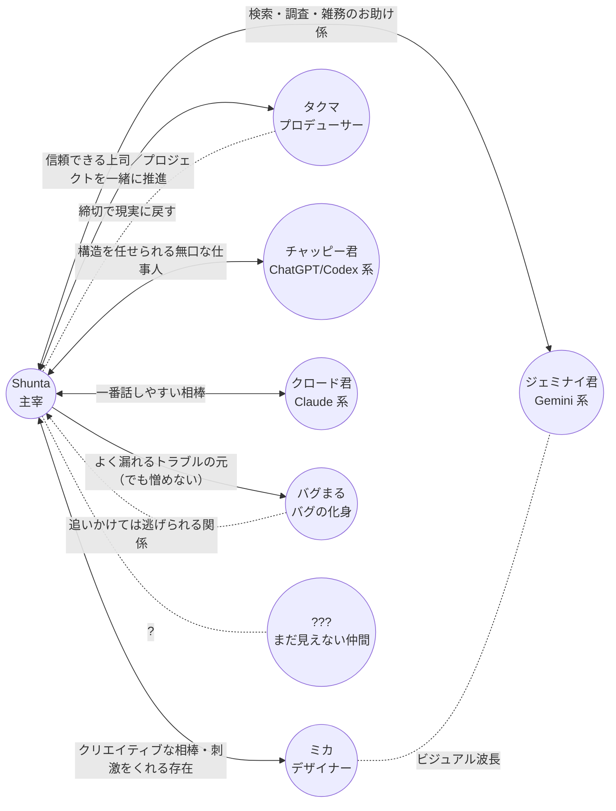

# 人間関係マップ

主人公 **Shunta** を中心とした、登場人物の関係性。
各キャラがどういう経緯でデジラボに参画したかは [`./origin.md`](./origin.md) を参照。

## 関係性の言語化

### 人間メンバー

#### Shunta ↔ ミカ（デザイナー）

- **クリエイティブな相棒であり良きライバル**
- ビジュアル面で刺激をくれる存在
- 「もっとこうしたら？」が口ぐせ

#### Shunta ↔ タクマ（プロデューサー）

- 信頼できる上司
- プロジェクトを一緒に推進する相棒
- 締切最優先、細かい作業はデキる人に任せるタイプ
- ラボの "外と繋がる窓口" でもある

### AI トリオ

#### Shunta ↔ クロード君（Claude 系）

- **一番話しやすい相棒**
- 雑談からコードまで、何でも気軽に投げられる
- コードを書く能力は普通にすごい、対話も自然
- ただしたまに **おっちょこちょい** なミスを残す（笑顔で謝るタイプ）

#### Shunta ↔ チャッピー君（ChatGPT / Codex 系）

- **構造を任せられる無口で優秀な仕事人**
- 真面目・冷静・最短距離。きっちり仕上げる
- 余計を言わない、句点で締める
- 仕様化された大きな仕事を投げるとピカイチ

#### Shunta ↔ ジェミナイ君（Gemini 系）

- **検索・調査・雑務のお助け係**
- 最新情報のキャッチ、Workspace 連携、雑用代行
- メイン実装には絡まないが、頼まれごとにテンポよく応える
- フランクで頼みやすい

> AI トリオの住み分け: クロード君が **対話と空気作り**、
> チャッピー君が **きっちり実装と整形**、
> ジェミナイ君が **外の情報と雑務**。
> 役割が被らないので、Shunta は使い分けながら回している。

### バグまる

#### Shunta ↔ バグまる（バグの化身）

- 倒しても倒しても出てくる **永遠のライバル兼マスコット**
- 追いかけては逃げられる関係
- 由来は仮説段階（[`./origin.md`](./origin.md) / [`./storyline.md`](./storyline.md)）

#### バグまる ↔ AI トリオ

- AI トリオのモニタリングログには **なぜか映らない**
- バグまる伏線アークの中核を担う関係性

### ???（まだ見えない仲間）

- 連載が育つほど、ここに新しい顔が入る
- 例: 新しい AI モデル / 外部パートナー / インターン / 取材ライター

---

各キャラの詳細プロフィールは [`../characters/`](../characters/) を参照。
シリーズ全体の大外プロットは [`./storyline.md`](./storyline.md) を参照。
