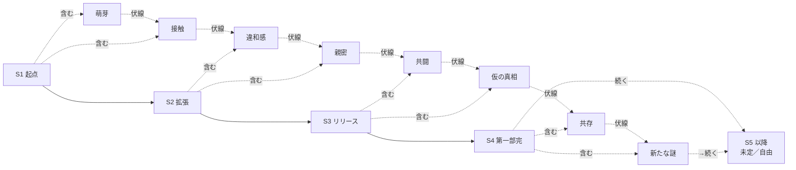

# 大外ストーリーライン (Overarching Plot)

> 1 話（4 シート × 4 コマ）は「単発で笑える」ことが最優先。背後に長期構造を
> 仕込んでおくと、続けて読む読者だけが拾える "もうひとつの楽しみ" が生まれる。
>
> このシリーズは **長期連載を前提** に設計する。
> 大方針は **「シーズン = 区切り」「全体 = 終わらせない」**。

## 0. 基本方針

- **終わらせないことを最優先**にする。"ゴール" や "最終話" を最初から決めない
- シーズンは "区切り" であって "完結" ではない。第一部完 → 第二部 → ...と
  いくらでも続けられる構造にしておく
- **ペースは固定しない**。毎日連載ではなく、テーマやネタが揃ったら
  リリースする運用にする（詳細は `workflow.md` のリリース単位を参照）
- バグまる伏線は「回収」ではなく **「謎が深まる／分岐する」** 設計にする
  → 仮の真相に近づいたあと、必ず新しい謎を生やせるようにしておく
- 新キャラ・新拠点・新プロダクト・季節回 / 年中行事回 / 番外編 を、
  いつでも増やせる余白を残す

## 1. プロジェクト軸（シーズン制 / 長期版）

シーズンごとにデジラボとして取り組む "大プロジェクト" を設定する。
日常回（1 話 = 4 シート × 4 コマ）は、そのプロジェクトの中の **1 場面の切り取り** として描く。

| シーズン | 仮タイトル                     | 主プロジェクト                                       | テーマ                                       |
| -------- | ------------------------------ | ---------------------------------------------------- | -------------------------------------------- |
| **S1**   | デジラボ、はじめる             | デジラボ公式サイト + ポートフォリオ                  | キャラ紹介・日常確立・シリーズの基盤         |
| **S2**   | AI と作る、AI と笑う           | アイリスを社内 AI から世の中向けプロダクト化         | AI ものづくりのリアル・運用・倫理            |
| **S3**   | リリースの先に                 | 大型リリース + 社外イベント + ユーザー対応           | "作る" から "届ける" へ。チーム拡張          |
| **S4**   | 第一部完: 共存のはじまり        | プロダクトの世代交代 + 新オフィス                    | バグまるとの関係に一区切り。だが終わらない   |

> シーズンの長さは **話数ではなくテーマ** で区切る。
> 想定したテーマ・出来事を一通り描き終えたら次シーズンへ移る、ぐらいの粒度で考える。

> S4 は **"最終章" ではない**。バグまるとの関係に節目を作るが、必ず新しい
> 謎を残す。S5 以降の構想は **あえて書かない** ことで自由を確保する。

## 2. バグまる "謎が深まる" 設計（B 軸）

倒すゴールも、解明するゴールも置かない。
代わりに **「層が増える」** ように伏線を配る。

### 各シーズンで起きること（暫定）

| 段階       | 出来事                                                                       | 出すタイミング |
| ---------- | ---------------------------------------------------------------------------- | -------------- |
| 萌芽       | Shunta が一瞬 "何か" を見る。アイリスのカメラには映らない                    | S1 中盤        |
| 接触       | バグまる、本番環境に出現。倒しても増える                                     | S1 後半        |
| 違和感     | アイリスの初期コミットログにバグまる的シルエットが映り込む                   | S2 序盤        |
| 親密       | バグまる、アイリスをかばう仕草を見せる                                       | S2 終盤        |
| 共闘       | バグまるがインシデントを "助ける" 動きを見せる                                | S3 中盤        |
| 仮の真相   | バグまるはアイリスのプロトタイプ由来らしい... という **仮説** に到達          | S3 終盤        |
| 共存       | Shunta は "倒さず共存" の方針を選ぶ                                          | S4 中盤        |
| 新たな謎   | **別系統の "バグまる的存在"** が他社プロダクトでも観測される（or 過去の研究にも痕跡） | S4 終盤        |

> 仮の真相に達したあと **必ず別の謎を生やす** ことで連載を引き伸ばせる。
> 各段階の間には、関係ない日常回や単発記事を挟む。伏線回は頻繁には出さない方針。

### 伏線回のルール

- 普通に読んでも 1 話として面白いことを最優先（伏線だけで読ませない）
- バグまるが意味あり気な仕草をするコマを 1 〜 2 つだけ仕込む
- front matter に `arc: bugmaru` を付け、串刺しで読めるようにする
- 真相を断定する描写は避け、解釈の余地を残す

## 3. 連載を長く続けるための仕掛け

長期連載を支えるネタ供給の仕組みを **最初から** 組み込んでおく。

### 3.1 ネタの "層"

| arc          | 役割                       | 目安比率 |
| ------------ | -------------------------- | -------- |
| `standalone` | 単発の日常回               | **約 7 割（主食）** |
| `main`       | シーズン主筋に絡む話       | 1.5 割   |
| `bugmaru`    | バグまる伏線回             | 0.5 割（控えめ） |
| `seasonal`   | 季節 / 年中行事回           | 1 割    |
| `side`       | 番外編・スピンオフ・過去回 | 0〜1 割（必要に応じて） |

`standalone` を 7 割以上に保つことで、**いつでも誰でも入れる連載** にする。

### 3.2 拡張の余白

長期連載は新陳代謝が必要。意図的に "後で追加できる枠" を残す。

- **新キャラ枠**: インターン / 新人 / 外部パートナー / 競合エンジニア /
  取引先デザイナー / カフェ店主 / SRE 担当 / 監査役 など
- **新拠点枠**: サテライトオフィス、出張先、海外支社、ワーケーション先、
  自宅、共用カフェ
- **新プロダクト枠**: アイリスの兄弟 AI、別チームのプロダクト、副業プロジェクト
- **ライバル枠**: 別会社のエンジニア、兄弟プロダクト、"別系統のバグまる" を
  扱う組織
- **時間枠**: 過去回・未来回（「10 年後のデジラボ」など）も解禁

### 3.3 シーズン末の小ピーク

「終わらせない」とはいえメリハリは必要。各シーズンの終盤には小ピークを置く。

- シーズン主プロジェクトの山場（リリース・登壇・受賞など）
- バグまるアークの "段が一つ進む" 回
- 翌シーズンへのフックとなる **小さな謎を 1 つだけ** 提示

## 4. 物語ロジック（イメージ）



## 5. 運用ルール

### エピソードの位置付けタグ

front matter `tags` に加えて、以下を入れる:

- `season: S1` 〜 `S4`（`S5+` 以降は決まり次第）
- `arc: main | bugmaru | standalone | seasonal | side`

例:
```yaml
season: S1
arc: bugmaru
```

### Milestone

GitHub の Milestone をシーズンに対応させる:

- `Season 1 — デジラボ、はじめる`
- `Season 2 — AI と作る、AI と笑う`
- `Season 3 — リリースの先に`
- `Season 4 — 第一部完: 共存のはじまり`

各シーズン末に `docs/seasons/SX-notes.md` を作り、出来事と伏線の
消化状況を残す（後で繋ぐときに役立つ）。

### "いつでもやめさせない" 設計

- 企画書に **「最終回」「完結」「ラスボス」を書かない**
- バグまるの真相は **書き手も完全には決めない**。仮説を増やしながら走る
- ネタが詰まったら、`arc: side`（スピンオフ・過去回・夢オチ）を増やす
- `ideas/` に **常時ストックを残す**（量より、いつでも次に進める状態を維持する）
- 季節回・年中行事回は再利用可（毎年新ネタにできる）
- ペース固定なし。出せる時に出す（詳細は `workflow.md`）

## 6. シーズン 1 詳細プロット（着手用）

### 物語の起点

- Shunta が「ものづくりの裏側を漫画で残してみよう」と決める
- ついでにデジラボ公式サイトも作ろう、と話が広がる

### 主な出来事（このシーズンで描きたいハイライト）

1. メンバーが日常に合流していく回（順序の暗黙の年表は [`./origin.md`](./origin.md)）
2. サイトのデザインで Shunta vs ミカが揉める / タクマが裁定者
3. 中盤: 本番環境にバグまる初登場
4. バグまる、倒しても増える／でも憎めない描写を積む
5. 季節回（桜・梅雨・夏祭り・忘年会・正月）を機会を見て挟む
6. 終盤: アイリスのログに不可解な記録 → S2 への引き

### このシーズンの "あるある" 在庫

- ドキュメント・README ネタ
- 命名・型・環境構築の沼
- AI に頼って逆に困る
- 動いた・何も触ってないのに
- フォント論争 / デザインレビュー
- コーヒーマシン故障
- リファクタリング誘惑に負ける
- 素数を選ぶエンジニア（外食回）

→ Issue として `ideas/` で管理（ideas backlog 参照）

---

## 関連ドキュメント

- [世界観](./world.md)
- [コアコンセプト](./concept.md)
- [人間関係マップ](./relationships.md)
- [ワークフロー](./workflow.md)
