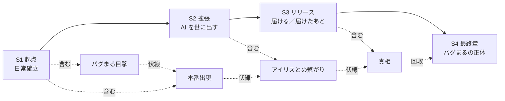

# 大外ストーリーライン (Overarching Plot)

> 4 コマは「単発で笑える」ことが最優先。ただし背後に **大きな流れ** を
> 仕込んでおくと、続けて読んだ読者にだけ "もうひとつの楽しみ" が生まれる。
>
> このシリーズは **A: シーズン制プロジェクト軸** ＋ **B: バグまる長期ミステリー**
> のハイブリッドで構成する。

## 1. プロジェクト軸（シーズン制）

シーズンごとにデジラボとして取り組む "大プロジェクト" を設定する。
日常 4 コマは、そのプロジェクト工程の中の **1 場面の切り取り** として描く。

| シーズン | 仮タイトル                  | 主プロジェクト                                       | テーマ                                       |
| -------- | --------------------------- | ---------------------------------------------------- | -------------------------------------------- |
| **S1**   | デジラボ、はじめる          | デジラボ公式サイト + ポートフォリオ (SNS 連携付き)   | キャラ紹介・日常の確立・シリーズの起点       |
| **S2**   | AI と作る、AI と笑う        | アイリスを社内 AI から世の中向けプロダクト化         | AI でものづくりするリアル・倫理・運用        |
| **S3**   | リリースの先に              | 大型リリース。社外イベント・ユーザーフィードバック   | "作る" から "届ける" へ。チームの成長        |
| **S4**   | バグまるの正体（最終章）    | プロダクト次世代版                                   | 大外プロットの回収。共存というオチ           |

> ※ シーズンの長さは固定しない。30 〜 50 話を目安に区切るが、ネタが続く限り
> 引き伸ばしても OK。

## 2. バグまる長期ミステリー（B 軸）

日常回の "背景" に伏線を散らしながら、月 1 〜 2 回の **伏線回** で謎を進行させる。
最終シーズンで一気に回収する。

### 伏線設計

| 段階     | 出来事                                                                 | 出すタイミング |
| -------- | ---------------------------------------------------------------------- | -------------- |
| 萌芽     | デバッグ中、Shunta が一瞬だけ "何か" を見る。アイリスのカメラには映らない | S1 中盤        |
| 接触     | バグまるが本番環境に出現。倒しても増える / 笑っているように見える     | S1 後半        |
| 違和感   | アイリスの初期コミットログに "バグまるのシルエット" が映り込んでいる   | S2 序盤        |
| 親密     | バグまる、アイリスをかばう仕草を見せる                                 | S2 終盤        |
| 真相     | バグまるはアイリスの初期プロトタイプから漏れ出た "未完成な意識" だった  | S3 終盤        |
| 共存     | Shunta は "バグを倒す" のではなく "共存する" 道を選ぶ                  | S4 最終話      |

### 伏線回のルール

- 伏線回は **必ず日常 4 コマのフォーマットを崩さない**（普通に読んでも面白い）
- バグまるが "意味あり気な仕草" をするコマを 1 つだけ入れる
- 該当エピソードの front matter に `arc: bugmaru` タグを付け、後で串刺しで読めるようにする
- メイン読者は "ちょっと不穏" を感じる程度。種明かし回でゾクッとさせる

## 3. シリーズ全体の物語ロジック



## 4. 運用ルール

### エピソードの位置付けタグ

front matter `tags` に加えて、以下を入れる:

- `season: S1` 〜 `S4`
- `arc: main` ＝ シーズンの主筋に絡む話
- `arc: bugmaru` ＝ バグまるの伏線回
- `arc: standalone` ＝ 単発（連載に絡まない普通の日常）

例:
```yaml
season: S1
arc: bugmaru
```

### マイルストーン

GitHub の Milestone をシーズンと対応づける。

- `Season 1 — デジラボ、はじめる`
- `Season 2 — AI と作る、AI と笑う`
- `Season 3 — リリースの先に`
- `Season 4 — バグまるの正体`

エピソード Issue / PR は対応するマイルストーンに紐付ける。

### "シーズンノート" の作り方

シーズンが進行したら、`docs/seasons/SX-notes.md` を作って
そのシーズンの主な出来事・伏線消化状況を残す（最終章で回収するときに役立つ）。

## 5. シーズン 1 詳細プロット（着手用）

### 物語の起点

- Shunta「毎日 4 コマ描こう」と宣言（→ episode 0001）
- ついでにデジラボ公式サイトも作る、と話が広がる

### 主な出来事

1. キャラ紹介回: アイリス → ミカ → タクマ の順で日常に登場
2. サイトのデザインで Shunta vs ミカが揉める
3. リリース直前、本番環境にバグまる初登場
4. バグまるはなぜか **倒しても増える** / でも憎めない
5. シーズン終盤、アイリスのログに不可解な記録 → S2 への引き

### サブテーマ（このシーズンの "あるある" 在庫）

- ドキュメント・README ネタ
- 命名・型・環境構築の沼
- AI に頼って逆に困る
- 動いた・何も触ってないのに
- フォント論争 / デザインレビュー
- コーヒーマシン故障

→ これらは Issue として `idea` ラベルで管理する。

---

## 関連ドキュメント

- [世界観](./world.md)
- [コアコンセプト](./concept.md)
- [人間関係マップ](./relationships.md)
- [ワークフロー](./workflow.md)
