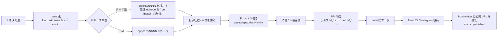

# 制作ワークフロー

「ネタを思いつく」から「投稿する」まで、このリポジトリ上でどう運用するか。

## 基本方針

- **毎日連載はしない**。出せるときに出す
- 公開の単位は「リリース単位」で考える。後述の 2 種類のいずれか
- 整合性のチェックや壁打ち相手として Claude Code を常駐させる

## リリース単位 (Release Unit)

このシリーズには 2 つのリリースタイプを設ける。

### A. テーマリリース（記事 + 関連 4 コマ N 本）

思想・テーマ系のネタはまず **Zenn 記事** に落とし、関連する 4 コマを 1〜数本
セットで公開する。X / Zenn 両方で読み応えを担保するための単位。

- 記事 1 本を起点にし、紐付く comic を 1〜数本添える
- 主に `arc: main`（シーズン主筋）や `arc: bugmaru`（伏線回）の重い回を
  この単位で扱う
- カデンス目安: 月 1〜2 本程度（無理なく出せる範囲で）

### B. 単発リリース（4 コマのみ）

`arc: standalone`（あるある日常 4 コマ）や軽い季節回はそのまま
**4 コマ単独** で公開する。記事は付けない。

- カデンス目安: ストックから機会を見て出す。週 0〜数本、無理しない

## ネタ → 公開までのフロー



## 1. ネタを思いつく

- すぐメモ → Issue を立てる（`idea` ラベル）
- Issue 内に **どのリリース単位を想定しているか** を書く
  - `kind: article-anchor` ＝ 記事 + 関連 4 コマで束ねる候補
  - `kind: comic` ＝ 単発 4 コマ向け

## 2. リリース起こし

### A. テーマリリースの場合

```bash
# 記事を起こす (Zenn 用)
cp articles/_template.md articles/0007-naming-jigoku.md
# 関連 4 コマを起こす (記事に紐づける数だけ)
cp episodes/_template.md episodes/0042-naming-jigoku-1.md
```

記事の front matter に紐づく episode を書く。

```yaml
related_episodes:
  - 0042
  - 0043
  - 0044
```

### B. 単発リリースの場合

```bash
cp episodes/_template.md episodes/0050-deploy-no-inori.md
```

## 3. 起承転結 / 本文を書く

- 4 コマ: `episodes/NNNN-slug.md` に起承転結
- 記事: `articles/NNNN-slug.md` に本文（謙虚なトーン推奨）

## 4. ネーム・下書き

- `assets/episodes/NNNN/` に画像を置く（`panel-1.png` ... `panel-4.png` など）
- エピソード Markdown 本文からリンクして見せる

## 5. レビュー

- 自分一人なら **PR を立ててセルフレビュー**
- Claude Code に PR レビューを依頼して整合性チェック
  - 過去話との矛盾がないか
  - キャラの口調がブレていないか
  - 大外プロットとの整合
- 「ここのセリフ言わせ過ぎ」「3 コマ目で笑いの起点を作ろう」のような
  PR コメントの赤入れも、過去の改善履歴として残しておく

## 6. 公開

- 投稿後、`status: published` に更新し、`post_urls` に SNS リンクを記入
- main にマージしたタイミングで完了

## ブランチ運用

- `main`: 公開済 + 公式設定
- `claude/article-NNNN-slug`: テーマリリース（記事 + 関連 episode）
- `claude/episode-NNNN-slug`: 単発エピソード制作用
- `claude/character-<name>`: キャラ設定変更用
- `claude/design-<topic>`: デザインシステム更新用

## ラベル設計（推奨）

| ラベル              | 用途                                     |
| ------------------- | ---------------------------------------- |
| `idea`              | バックログにある段階のネタ               |
| `kind:article`      | 記事系のネタ（article-anchor 候補）       |
| `kind:comic`        | 単発 4 コマ向けネタ                       |
| `episode`           | エピソード化された案件                    |
| `article`           | 記事化された案件                          |
| `character-update`  | キャラ設定の追加・変更                    |
| `design`            | デザインシステム関連                      |
| `published`         | 公開済                                    |
| `retro`             | 振り返り・リサイクルしたいネタ            |

## 補足: AI 相棒（Claude Code）の役割

このワークフローでは Claude Code を **「世界法則の番人」** 兼編集者として
常駐させる前提でいる。任せたい役割は `articles/` の運用紹介記事に書いてある
通りで、ざっくり以下:

- 整合性のガード（過去話との矛盾検出）
- 壁打ち相手（展開・キャラ性格の妥当性チェック）
- 設定・世界観の保持
- 過去話との照合と補正提案
