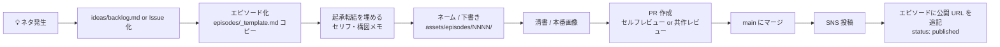

# 制作ワークフロー

「ネタを思いつく」から「投稿する」まで、このリポジトリ上でどう運用するか。



## 1. ネタを思いつく

- すぐメモ → `ideas/backlog.md` に 1 行追加 **か** Issue を立てる
- Issue ラベル: `idea`, `episode-candidate`, `character-update`, `design`, `bug` など

## 2. エピソード化

```bash
# 番号は連番。zero-pad 4 桁推奨。
cp episodes/_template.md episodes/0042-debug-jigoku.md
```

front matter を埋める:

```yaml
---
id: 0042
title: "デバッグ地獄からのひらめき"
status: draft        # draft | inking | ready | published
tags: [デバッグ, ひらめき]
characters: [shunta, bugmaru, iris]
created: 2026-04-29
published_at:
post_urls:
  x:
  instagram:
---
```

## 3. ネーム・下書き

- `assets/episodes/0042/` に画像を置く（`panel-1.png` ... `panel-4.png` など）
- エピソード Markdown 本文からリンクして見せる

## 4. レビュー

- 自分一人なら **PR を立ててセルフレビュー** が便利
- 「ここのセリフ言わせ過ぎ」「3 コマ目で笑いの起点を作ろう」みたいに
  PR コメントで赤入れすると、**過去の改善履歴も残る**
- 共作の場合はミカ役 / タクマ役のレビュアーをアサイン

## 5. 公開

- 投稿後、`status: published` に更新し、`post_urls` に SNS リンクを記入
- main にマージしたタイミングで完了

## ブランチ運用

- `main`: 公開済 + 公式設定
- `episode/NNNN-slug`: エピソード制作用
- `character/<name>`: キャラ設定変更用
- `design/<topic>`: デザインシステム更新用

## ラベル設計（推奨）

| ラベル              | 用途                                     |
| ------------------- | ---------------------------------------- |
| `idea`              | バックログにある段階のネタ               |
| `episode`           | エピソード化された案件                   |
| `character-update`  | キャラ設定の追加・変更                   |
| `design`            | デザインシステム関連                     |
| `published`         | 公開済                                   |
| `retro`             | 振り返り・リサイクルしたいネタ           |
